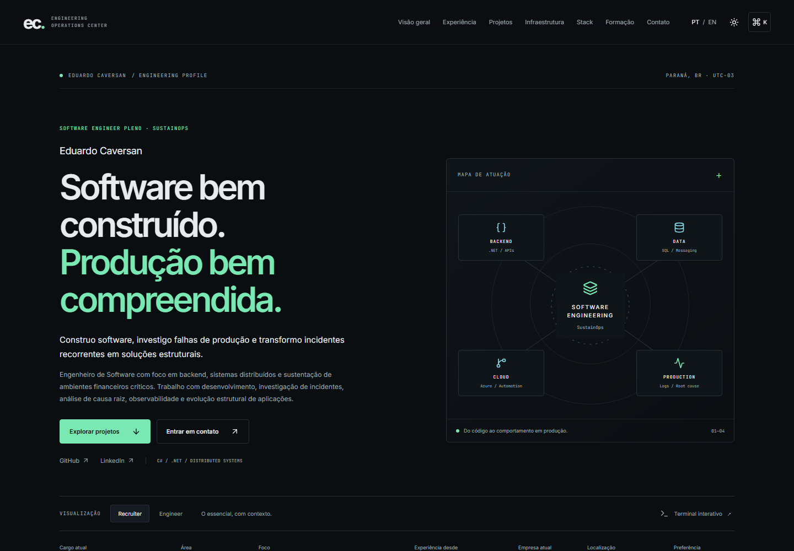
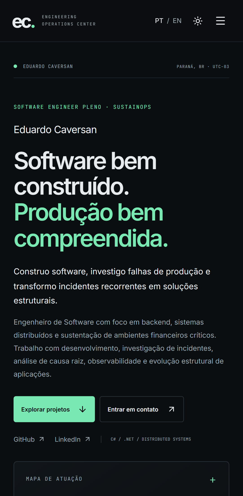

# Eduardo Caversan · Engineering Operations Center

Portfólio profissional de **Eduardo Caversan, Software Engineer Pleno em SustainOps**. Uma aplicação estática com foco em backend, sistemas distribuídos, investigação de incidentes e evolução de software em produção.

**Site:** [eduardocaversan.github.io/portfolio](https://eduardocaversan.github.io/portfolio/)

## Interface real

Capturas do build de produção, geradas com Playwright. Os diagramas dos projetos são representações de arquitetura, não screenshots fictícios de aplicações.

| Desktop                                                        | Mobile                                                       |
| -------------------------------------------------------------- | ------------------------------------------------------------ |
|  |  |

[Página completa em desktop](docs/screenshots/desktop.png) · [Página completa em mobile](docs/screenshots/mobile.png) · [Tema claro em inglês](docs/screenshots/desktop-light-engineer.png)

## Stack

React, TypeScript estrito, Vite, Motion, Lucide e CSS nativo. Fontes Inter e JetBrains Mono hospedadas junto com a aplicação. Vitest e Testing Library cobrem comportamento; Playwright e axe-core validam o build no navegador. ESLint sem warnings.

Não há backend, banco, serviço pago, telemetria, token ou dependência da API do GitHub. Os únicos dados salvos pelo site são preferências locais e a indicação de inicialização por sessão. Os laboratórios cloud descritos são projetos do autor; visitar ou compilar o portfólio não provisiona infraestrutura.

## Execução local

Pré-requisito: Node.js **24 LTS** e npm. A versão está declarada em `.nvmrc` e `package.json`.

```sh
npm ci
npm run dev
```

Abra `http://127.0.0.1:5173/portfolio/`.

```sh
npm run lint
npm test
npm run build
npx playwright install chromium
npm run test:e2e
npm run preview
```

No Linux/CI, use `npx playwright install --with-deps chromium`. `npm run validate` reúne lint, testes, build e testes de navegador; o navegador deve estar instalado. O preview usa `http://127.0.0.1:4173/portfolio/`. O build é emitido em `dist/`.

## Organização

```text
src/
  components/       Seções, navegação, diálogos e terminal
  data/             Conteúdo e modelos tipados PT-BR/EN
    content.ts      Textos de interface
    profile.ts      Perfil, experiência, formação e competências
    projects.ts     Projetos, categorias, links, branches e diagramas
    types.ts        Contratos compartilhados
  hooks/            Preferências e metadados por idioma
  lib/              Parser, filtros e persistência defensiva
  test/             Configuração de testes de componente
  App.tsx           Composição da página
  styles.css        Tokens, componentes, temas e responsividade
public/             Favicon EC, imagem social, sitemap e robots
tests/              Testes de navegador sobre o build de produção
scripts/            Geração de imagem social e auditorias
docs/               Capturas reais e relatório de validação
.github/workflows/  Validação e deploy no GitHub Pages
```

## Conteúdo e personalização

Edite `src/data` para atualizar o perfil e os projetos. Todos os textos principais possuem versões explícitas em português e inglês; não há tradução automática. O cargo público é `Software Engineer Pleno` e a área é `SustainOps`, inclusive no idioma inglês. A promoção na Celcoin foi em março de 2026.

Cada projeto declara categoria, status honesto (`Project`, `Lab`, `Experiment`), descrição curta e técnica, tecnologias, links e fluxo quando útil. **TaskFlow aponta para `entrega-3`**, pois a branch padrão é uma entrega parcial. Os dois repositórios Terraform/Asterisk formam um único case. Projetos excluídos e o currículo antigo não são publicados.

Tokens visuais e temas estão no início de `src/styles.css`. Ao alterar domínio/base path, atualize também `vite.config.ts`, `index.html`, `public/sitemap.xml`, `public/robots.txt` e `profile.url`. Regenere a imagem social com `npm run assets:social` (Chromium instalado). Para Lighthouse, inicie `npm run preview -- --port 4174` e execute `npm run audit`.

## Interações

- PT-BR inicial, EN alternativo; tema escuro inicial e opção clara.
- Recruiter apresenta o essencial; Engineer expande tecnologias e arquitetura. Experiência, projetos, infraestrutura e contato permanecem em ambos.
- `Ctrl+K` / `Cmd+K`: navegação, idioma, tema, densidade, links, cópia de e-mail e terminal.
- Terminal opcional: `help`, `whoami`, `experience`, `projects`, `projects --stack dotnet`, `projects --stack go`, `projects --stack cloud`, `skills`, `education`, `contact`, `github`, `linkedin`, `clear`.
- Tab completa comandos; setas percorrem histórico; botões atendem mobile. `github` e `linkedin` retornam links explícitos. Nenhum comando real é executado.
- Inicialização de 850 ms, pulável, uma vez por sessão e ignorada com movimento reduzido. É um aviso não modal e nunca impede a navegação.

Preferências são validadas antes do uso. Se o navegador bloquear storage, a aplicação continua funcionando. Não existe botão de currículo sem um documento atualizado.

## Acessibilidade e design

HTML semântico, link para pular navegação, estados de foco, controles nomeados e navegação por teclado. Diálogos nativos mantêm foco modal, fecham com Escape e devolvem o foco ao elemento anterior. A saída do terminal usa uma região de log acessível. Motion respeita `prefers-reduced-motion`; o CSS também elimina transições e rolagem animada nessa preferência.

O visual combina grafite, verde operacional e ciano, com contraste verificado nos dois temas. Timeline e linhas de competências evitam uma página composta apenas por cartões. Diagramas em HTML/CSS/SVG substituem imagens genéricas. Não há contadores de uptime, disponibilidade, receita ou métricas de impacto inventadas. As composições dos projetos representam conceitos, não resultados medidos.

Os diálogos são carregados sob demanda. Não há requests externos para fontes ou conteúdo. Metadados de Open Graph/Twitter, canonical e JSON-LD estão no HTML inicial; idioma e descrição também acompanham a preferência do visitante.

## Deploy no GitHub Pages

1. Em **Settings → Pages → Build and deployment**, selecione **GitHub Actions** como Source. Isso substitui a configuração antiga baseada em `gh-pages`.
2. Revise e faça merge da PR em `master`.
3. O workflow faz checkout, configura Node 24, executa `npm ci`, lint, Vitest, build, testes Playwright/axe e upload do artefato estático. O job de deploy usa `pages: write` e `id-token: write`.
4. O ambiente `github-pages` recebe o artefato. Não são necessários segredos personalizados. PRs somente validam; não publicam.

As actions oficiais usam as versões estáveis verificadas durante a implementação: checkout v7, setup-node v7, configure-pages v6, upload-pages-artifact v5 e deploy-pages v5. Referências: [deploy estático no Vite](https://vite.dev/guide/static-deploy#github-pages), [actions/deploy-pages](https://github.com/actions/deploy-pages).

O base path é `/portfolio/`. A navegação usa âncoras na mesma página, portanto links como `/portfolio/#projects` suportam atualização direta no Pages sem rewrites ou backend. Não há rotas virtuais que precisem de `404.html`.

O sitemap inclui a única página canônica. `robots.txt` é publicado em `/portfolio/robots.txt` como documentação; crawlers consultam a raiz do host (`/robots.txt`). Configurar essa raiz exigiria outro repositório, fora do escopo. O sitemap pode ser informado diretamente a ferramentas de busca.

O rodapé informa a entrega estática no Pages e aponta para o código. Não representa uma consulta em tempo real ao estado do GitHub Actions.

## Validação

Veja [docs/validation.md](docs/validation.md) para resultados, versões, acessibilidade, Lighthouse e limitações. Capturas de desktop/mobile são regeneradas pelo teste de navegador. A medição Lighthouse é local e varia com máquina, cache e condições de rede; não é uma promessa de desempenho em produção.

## Licença e autor

Código sob [MIT](LICENSE). Dados biográficos identificam o autor e devem ser substituídos em forks. Fontes distribuídas pelo Fontsource conservam suas licenças de origem.

[Eduardo Caversan](https://github.com/EduardoCaversan) · [LinkedIn](https://www.linkedin.com/in/deveduardocaversan/) · [educaversan.dev@gmail.com](mailto:educaversan.dev@gmail.com)
